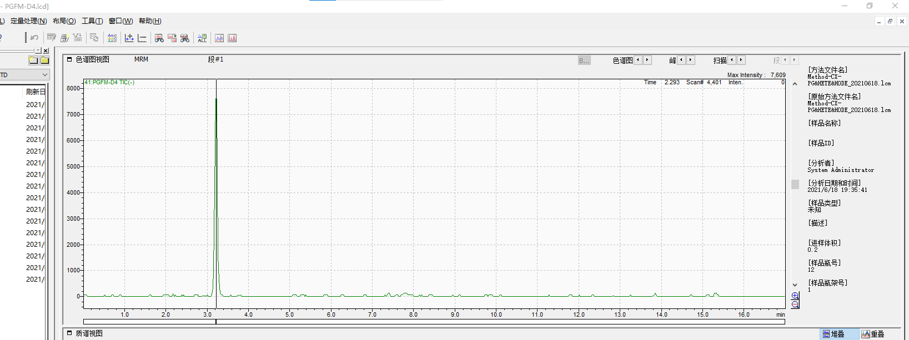

# Arachidonic Acid Derived Lipids

## Sample preparation

1. 取400μL 样品到2ml EP管
2. 加入10μL 内标 (0.5 ng/mL in ethanol), 涡旋
3. 用1N HCl调节PH至3.0 (500ul组织研磨液加10ul)
4. 1.2mL of Hexane : MTBE (50:50, v/v) into the tube, then vortex for 1min
5. Centrifuge 5 minutes at 5000g
6. 转移上清至新的2ml tube
7. 重复步骤4, 5
8. 合并上清液，吹干
9. Reconstitute with 50 µl of mobile phase A , vortex, 超声5min,14000g离心取35ul上清至进样瓶

> 组织样品离心后上清液有脂质出现，转移时要避开  
> 2ml EP管离心后不好吸, 可转移至1.5mlEP管  
> 转移的上清不能有沉淀, 可用20ul枪吸两次  

Mobile phase A: Water:Acetonitrile:Formic acid = 63:37:0.02  
Mobile phase B: Acetonitrile:Isopropyl alcohol = 50:50  

Column: Kinetex 2.6 μm C18, 100 x 2.1 mm  

Inject volumn: 5 μl (tissue)

| Method Time (minutes) | Mobile phase A% | Mobile phase B% | Flow Rate (μL/min) |
| ------------------------ | ------------------ | ------------------ | --------------------- |
| 0.00                     | 100                | 0                  | 350                   |
| 6.00                     | 92                 | 8                  | 350                   |
| 6.50                     | 45                 | 55                 | 350                   |
| 10.00                    | 45                 | 55                 | 350                   |
| 13.00                    | 0                  | 100                | 350                   |
| 14.00                    | 0                  | 100                | 350                   |
| 14.50                    | 100                | 0                  | 350                   |
| 17.00                    | 100                | 0                  | 350                   |

  
Figure 1. Major enzymatic pathways for the synthesis of arachidonic acid-derived eicosanoids  

  
Figure 2. Representative chromatogram of arachidonic acid-derived eicosanoids in the targeted metabolomic analysis by liquid chromatography – mass spectrometry  

| ID # | chemical           | 事件号    | RT    | m/z               |
| ---- | ------------------ | --------- | ----- | ----------------- |
| 1    | 15d-PGJ2           | 1:MRM(-)  | 7.8   | 315.1000>271.1000 |
| 2    | 15d-PGJ2-D4        | 2:MRM(-)  | 0.1   | 319.1000>275.1000 |
| 3    | 20HETE             | 3:MRM(-)  | 8.45  | 319.1500>289.1000 |
| 4    | 20HETE-D6          | 4:MRM(-)  | 8.45  | 325.1000>295.1000 |
| 5    | 5,6-EET            | 5:MRM(-)  | 8.25  | 319.2000>219.1000 |
| 6    | 8,9-EET            | 6:MRM(-)  | 8.5   | 319.2000>123.2000 |
| 7    | 14,15-EET          | 7:MRM(-)  | 8.25  | 319.2000>219.2000 |
| 8    | 14,15-EET-D11      | 8:MRM(-)  | 0.1   | 330.2000>219.2000 |
| 9    | 15HETE             | 9:MRM(-)  | 8.45  | 319.1500>219.1000 |
| 10   | 15HETE-D8          | 10:MRM(-) | 0.1   | 327.1500>226.2000 |
| 11   | 12HETE             | 11:MRM(-) | 8.45  | 319.2000>179.2000 |
| 12   | 12HETE-D8          | 12:MRM(-) | 8.45  | 327.2000>184.2000 |
| 13   | 11,12-EET          | 13:MRM(-) | 8.4   |                   |
| 14   | 5HETE              | 14:MRM(-) | 8.7   | 319.2000>115.2000 |
| 15   | 14,15-DHET         | 15:MRM(-) | 7.6   | 337.2000>207.1000 |
| 16   | 11,12-DHET         | 16:MRM(-) | 7.7   | 337.2000>167.1000 |
| 17   | 8,9-DHET           | 17:MRM(-) | 7.7   | 337.2000>127.1000 |
| 18   | 5,6-DHET           | 18:MRM(-) | 8     | 337.2000>145.1000 |
| 19   | 5HETE-D8           | 19:MRM(-) | 0.1   | 327.2000>116.2000 |
| 20   | 5-IPF2A-VI         | 20:MRM(-) | 1.69  | 353.1000>115.0000 |
| 21   | AA                 | 21:MRM(-) | 11.6  | 303.6500>259.2500 |
| 22   | 13HODE             | 22:MRM(-) | 8.1   | 295.1000>195.0000 |
| 23   | 13HODE-D4          | 23:MRM(-) | 8.1   | 299.3000>198.2000 |
| 24   | 9HODE              | 24:MRM(-) | 8.2   | 295.1010>171.0000 |
| 25   | PGJ2               | 25:MRM(-) | 5.51  | 333.2000>233.1000 |
| 26   | PGE2-D4-2.15       | 26:MRM(-) | 2     | 355.1000>193.0000 |
| 27   | PGD2-D4-2.6        | 27:MRM(-) | 0.1   | 355.1000>275.1000 |
| 28   | PGE2-2.15          | 28:MRM(-) | 2     | 351.1000>271.1000 |
| 29   | 8-ISO-PGF2A        | 29:MRM(-) | 1.45  | 353.1000>193.0000 |
| 30   | 8-ISO-PGF2A-D4     | 30:MRM(-) | 1.45  | 357.2000>197.2000 |
| 31   | 8-ISO-PGF1A        | 31:MRM(-) | 1.45  | 355.2000>311.2000 |
| 32   | PGF2A              | 32:MRM(-) | 1.6   | 353.1000>309.1000 |
| 33   | PGF2A-D4           | 33:MRM(-) | 0.001 | 357.1000>313.3000 |
| 34   | PGFM               | 34:MRM(-) | 2.6   | 353.2000>183.2000 |
| 35   | PGI2               | 35:MRM(-) | 0.91  | 369.1000>163.0000 |
| 36   | PGI2-D4            | 36:MRM(-) | 0.1   | 373.2000>249.1000 |
| 37   | LTE4               | 37:MRM(-) | 5.57  | 438.1000>333.0000 |
| 38   | LTC4               | 38:MRM(-) | 5.01  | 624.2000>272.0000 |
| 39   | LTC4-D5            | 39:MRM(-) | 0.1   | 629.2000>272.3000 |
| 40   | LTE4-D5            | 40:MRM(-) | 0.1   | 443.2000>338.2000 |
| 41   | PGFM-D4            | 41:MRM(-) | 2.6   | 357.2000>187.2000 |
| 42   | PGD2-2.61          | 42:MRM(-) | 2.6   | 351.1000>271.1000 |
| 43   | 15D-PGD2           | 43:MRM(-) | 7.3   | 333.1000>271.1200 |
| 44   | LTB4               | 44:MRM(-) | 7.46  | 335.1000>195.0000 |
| 45   | LTB4-D4            | 45:MRM(-) | 0.1   | 339.2000>197.2000 |
| 46   | 11-dehydro-TXB2    | 46:MRM(-) | 2.41  | 367.1000>305.0000 |
| 47   | 11-dehydro-TXB2-D4 | 47:MRM(-) | 0.1   | 371.2000>309.2000 |
| 48   | TXB2               | 48:MRM(-) | 1.3   | 369.2000>169.0000 |
| 49   | TXB2-D4            | 49:MRM(-) | 0.1   | 373.1000>173.2000 |
| 50   | AA-D8              | 50:MRM(-) | 0.1   | 311.6500>267.2500 |

未使用内标
| ID # | chemical           | 事件号    | RT    | m/z               |
| ---- | ------------------ | --------- | ----- | ----------------- |
| 2    | 15d-PGJ2-D4        | 2:MRM(-)  | 0.1   | 319.1000>275.1000 |
| 8    | 14,15-EET-D11      | 8:MRM(-)  | 0.1   | 330.2000>219.2000 |
| 10   | 15HETE-D8          | 10:MRM(-) | 0.1   | 327.1500>226.2000 |
| 19   | 5HETE-D8           | 19:MRM(-) | 0.1   | 327.2000>116.2000 |
| 27   | PGD2-D4-2.6        | 27:MRM(-) | 0.1   | 355.1000>275.1000 |
| 33   | PGF2A-D4           | 33:MRM(-) | 0.001 | 357.1000>313.3000 |
| 39   | LTC4-D5            | 39:MRM(-) | 0.1   | 629.2000>272.3000 |
| 40   | LTE4-D5            | 40:MRM(-) | 0.1   | 443.2000>338.2000 |
| 45   | LTB4-D4            | 45:MRM(-) | 0.1   | 339.2000>197.2000 |
| 47   | 11-dehydro-TXB2-D4 | 47:MRM(-) | 0.1   | 371.2000>309.2000 |
| 49   | TXB2-D4            | 49:MRM(-) | 0.1   | 373.1000>173.2000 |
| 50   | AA-D8              | 50:MRM(-) | 0.1   | 311.6500>267.2500 |

| Internal standard | Concentration (ng/μL) |
| ----------------- | --------------------- |
| 8-ISO-PGF2A-D4    | 0.5                   |
| 12HETE-D8         | 0.5                   |
| PGE2-D4-2.15      | 0.5                   |
| 13HODE-D4         | 0.5                   |
| PGFM-D4           | 0.1                   |

各内标出峰时间截图
  
  
  
  
  
  
  
  
  
  
  
  
