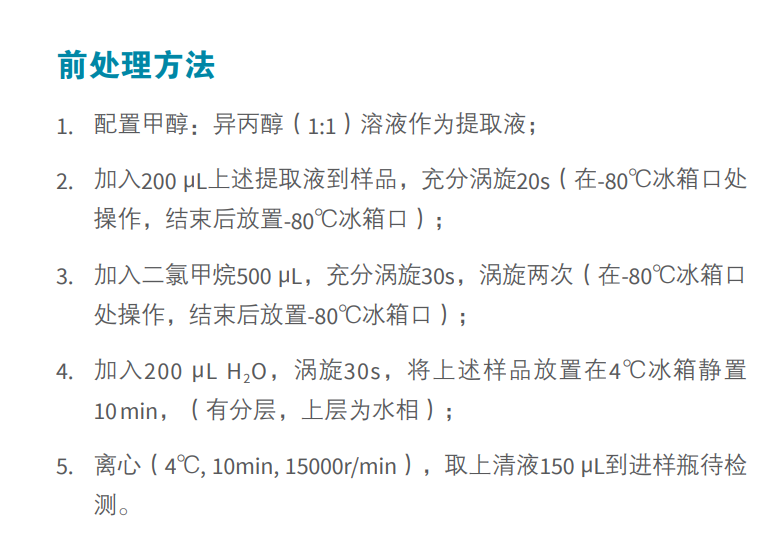
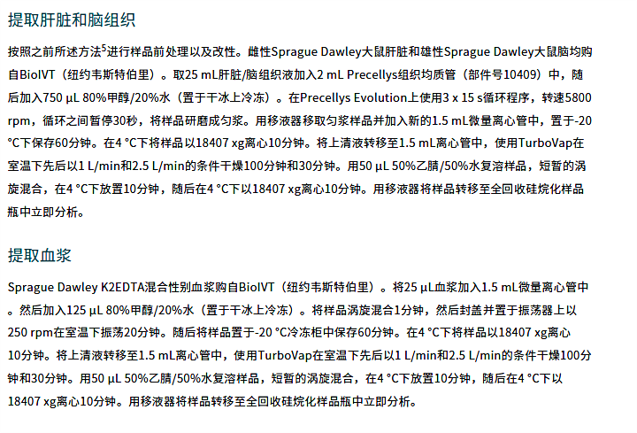

# Liver, Brain, Plasma

## 提取肝脏和脑组织

按照之前所述方法进行样品前处理以及改性。雌性Sprague Dawley大鼠肝脏和雄性Sprague Dawley大鼠脑均购自BiolVT (纽约韦斯特伯里)。取25 mL肝脏/脑组织液加入2 mL Precellys组织均质管(部件号10409)中，随后加入750μL 80%甲醇/20%水(置于干冰上冷冻)。在Precellys Evolution. 上使用3 x 15 s循环程序，转速5800rpm,循环之间暂停30秒，将样品研磨成匀浆。用移液器移取匀浆样品并加入新的1.5 mL微量离心管中，置于-20。C下保存60分钟。在4°C下将样品以18407xg离心10分钟。将上清液转移至1.5 mL离心管中，使用TurboVap在室温下先后以1 L/min和2.5 L/min的条件干燥100分钟和30分钟。用50μL 50%乙睛/50%水复溶样品，短暂的涡旋混合，在4°C下放置10分钟，随后在4°C下以18407xg离心10分钟。用移液器将样品转移至全回收硅烷化样品瓶中立即分析。

## 提取血浆

Sprague Dawley K2EDTA混合性别血浆购自BiolVT (纽约韦斯特伯里)。将25μL血浆加入1.5mL微量离心管中。然后加入125μL 80%甲醇/20%水 (置于干冰上冷冻)。将样品涡旋混合1分钟，然后封盖并置于振荡器上以250rpm在室温下振荡20分钟。随后将样品置于-20°C冷冻柜中保存60分钟。在4°C下将样品以18407xg离心10分钟。将上清液转移至1.5mL离心管中，使用TurboVap在室温下先后以1 L/min和2.5 L/min的条件干燥100分钟和30分钟。用50 μL 50%乙睛/50%水复溶样品，短暂的涡旋混合，在4°C下放置10分钟，随后在4°C下以18407xg离心10分钟。用移液器将样品转移至全回收硅烷化样品瓶中立即分析。
