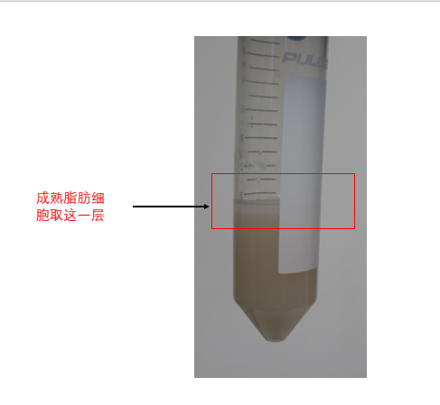

# Isolation and Differentiation of Primary Adipose SVF cells

## Reagents：

1. SVF media:  
   To 500 mL bottle of DMEM/F12 add:  
   55 mL of filtered FBS (Lot tested to support differentiation)  
   5 mL of Pen/Strep  
2. 100 μm and 40 μm cell strainer  
3. Digestion buffer:  
   For 10 mL:  
   10 mL HBSS
   10 mg Collagenase D (Roche) (1 mg/mL= final concentration)  
   0.15 g of BSA (1.5%=final concentration)  

## Stock solutions

**Insulin: 5 mg/ml = 1000X**

1. Make 1M HCl: 2.5ml 12M HCl + 27.5ml ddH2O
2. Make 50mM HCl: 2ml 1M HCl+ 38ml ddH2O
3. Dissolve 100mg of insulin (Sigma I6634) in 20ml of 50mM HCl.

**IBMX: 250mM = 500X**

Dissolve 832.5 mg of IBMX (Sigma I7018)  
in 15ml of DMSO.

**Dexamethasone: 1mM = 1000X**

Dissolve 5.88mg of dexamethasone (Sigma D4902) in 15ml EtOH.

## SVF isolation

1. 在1.5mL EP中加入digestion buffer，取小鼠inguinal WAT，放到1.5mL EP管中，至于冰上。(每管4块inguinal, 300μL digestion buffer, reasonable)
2. 用眼科剪将iWAT剪碎，肉眼看不到大块脂肪组织。
3. 将剪碎后的脂肪组织转移到50mL离心管中，10块fat pad用25mL digestion buffer，37度水浴锅120速度，消化30min-40min，每隔10分钟拿出来剧烈颠倒混匀。
4. 消化完成，用100μm 细胞筛过滤，加入30mL SVF media，600g离心5min。
5. 需要脂肪组织，取上面白色的一层；取SVF的话，将上面全部弃掉，留下下面的细胞沉淀。
   
6. 用10mL SVF media将细胞重悬，过40μm细胞筛，600g离心5分钟。
7. 弃上清，将细胞重悬后铺板。
8. 经验来说，两个inguinal铺到一个100mm dish里, 每天换液的情况下，大约24x6小时长到80%
9. 等传代后的细胞长满以后，再过12个小时，加入诱导液，诱导48h。（诱导液配制： SVF media加入终浓度为5 ug/ml insulin+1uM Dexamethasone +0.5 mM isobutylmethylxanthine (IBMX) +1 uM Rosiglitazone）
10. 诱导48h后，换成maintain buffer（SVF media 中加入5 ug/ml insulin），每隔两天换一次maintain buffer，第6天细胞已经分化成为成熟的脂肪细胞。