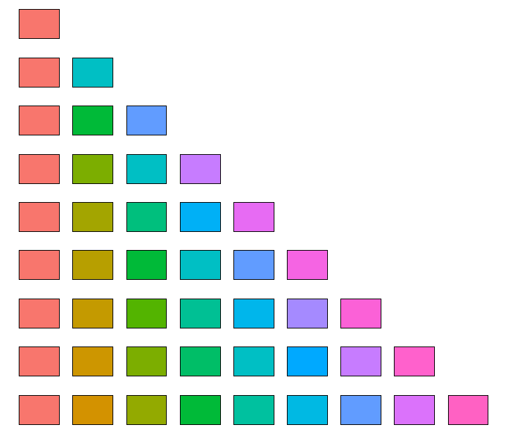

# pal

hex
[1] "#F8766D"
[1] "#F8766D" "#00BFC4"
[1] "#F8766D" "#00BA38" "#619CFF"
[1] "#F8766D" "#7CAE00" "#00BFC4" "#C77CFF"
[1] "#F8766D" "#A3A500" "#00BF7D" "#00B0F6" "#E76BF3"
[1] "#F8766D" "#B79F00" "#00BA38" "#00BFC4" "#619CFF" "#F564E3"
[1] "#F8766D" "#C49A00" "#53B400" "#00C094" "#00B6EB" "#A58AFF" "#FB61D7"
[1] "#F8766D" "#CD9600" "#7CAE00" "#00BE67" "#00BFC4" "#00A9FF" "#C77CFF" "#FF61CC"