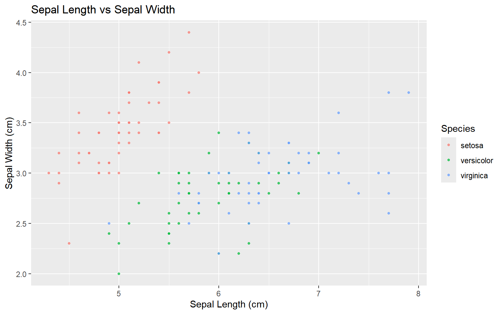

```r
library(dplyr)
```

``` text

Attaching package: 'dplyr'
```

``` text
The following objects are masked from 'package:stats':

    filter, lag
```

``` text
The following objects are masked from 'package:base':

    intersect, setdiff, setequal, union
```

```r
library(ggplot2)
```


```r
iris %>%
    ggplot(aes(x = Sepal.Length, y = Sepal.Width, color = Species)) +
    geom_point(size = 1, alpha = 0.7) +
    labs(
        title = "Sepal Length vs Sepal Width",
        x = "Sepal Length (cm)",
        y = "Sepal Width (cm)",
        color = "Species"
    )
```


